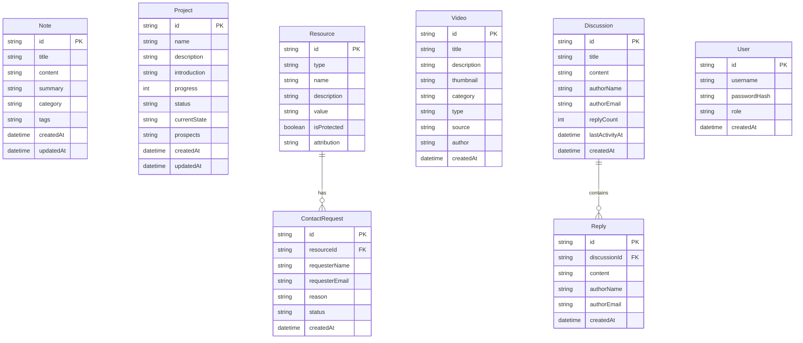

# Design Document

## Overview

本设计文档描述了个人博客系统的技术架构和实现方案。系统采用现代前端技术栈，以 React + TypeScript 为核心，结合 Next.js 框架实现服务端渲染和静态生成，提供优秀的性能和 SEO 支持。系统特色是酷炫的区块链风格首页，使用 Three.js 或 Canvas 实现粒子网络动画效果。

## Architecture

系统采用前后端分离的架构，前端使用 Next.js 框架，后端使用 Next.js API Routes 提供 RESTful API。


### Technology Stack

- **Frontend**: Next.js 14, React 18, TypeScript
- **Styling**: Tailwind CSS, Framer Motion
- **3D/Animation**: Three.js 或 react-particles
- **State Management**: React Context + useReducer
- **Backend**: Next.js API Routes
- **Database**: SQLite (通过 better-sqlite3) 或 JSON 文件存储
- **Authentication**: JWT + bcrypt
- **External APIs**: CoinGecko API (区块链行情)

## Components and Interfaces

### Core Components

```typescript
// 页面组件结构
interface PageComponent {
  layout: 'default' | 'fullscreen' | 'admin';
  metadata: PageMetadata;
}

interface PageMetadata {
  title: string;
  description: string;
  keywords: string[];
}
```

### Component Hierarchy


### Key Interfaces

```typescript
// 笔记接口
interface Note {
  id: string;
  title: string;
  content: string;
  summary: string;
  category: string;
  tags: string[];
  createdAt: string;
  updatedAt: string;
}

// 项目接口
interface Project {
  id: string;
  name: string;
  description: string;
  introduction: string;
  progress: number; // 0-100
  status: 'planning' | 'in-progress' | 'completed' | 'paused';
  currentState: string;
  prospects: string;
  createdAt: string;
  updatedAt: string;
}

// 资源接口
interface Resource {
  id: string;
  type: 'contact' | 'group' | 'third-party';
  name: string;
  description: string;
  value: string;
  isProtected: boolean;
  attribution?: string;
}

// 联系申请接口
interface ContactRequest {
  id: string;
  resourceId: string;
  requesterName: string;
  requesterEmail: string;
  reason: string;
  status: 'pending' | 'approved' | 'rejected';
  createdAt: string;
}

// 视频接口
interface Video {
  id: string;
  title: string;
  description: string;
  thumbnail: string;
  category: string;
  type: 'embedded' | 'external';
  source: string; // URL or embed code
  author: string;
  createdAt: string;
}

// 区块链数据接口
interface CryptoPrice {
  id: string;
  symbol: string;
  name: string;
  price: number;
  change24h: number;
  marketCap: number;
  lastUpdated: string;
}

interface BlockchainNews {
  id: string;
  title: string;
  summary: string;
  source: string;
  url: string;
  publishedAt: string;
}

// 讨论接口
interface Discussion {
  id: string;
  title: string;
  content: string;
  authorName: string;
  authorEmail: string;
  replyCount: number;
  lastActivityAt: string;
  createdAt: string;
}

interface Reply {
  id: string;
  discussionId: string;
  content: string;
  authorName: string;
  authorEmail: string;
  createdAt: string;
}

// 用户接口
interface User {
  id: string;
  username: string;
  passwordHash: string;
  role: 'admin' | 'visitor';
  createdAt: string;
}

// 个人资料接口
interface Profile {
  name: string;
  avatar: string;
  bio: string;
  skills: string[];
  experience: Experience[];
  socialLinks: SocialLink[];
}

interface Experience {
  title: string;
  company: string;
  period: string;
  description: string;
}

interface SocialLink {
  platform: string;
  url: string;
  icon: string;
}
```

## Data Models

### Database Schema



### JSON Storage Format

数据将以 JSON 文件形式存储在 `data/` 目录下：

```
data/
├── notes.json
├── projects.json
├── resources.json
├── contact-requests.json
├── videos.json
├── discussions.json
├── replies.json
├── users.json
└── profile.json
```


## Correctness Properties

*A property is a characteristic or behavior that should hold true across all valid executions of a system-essentially, a formal statement about what the system should do. Properties serve as the bridge between human-readable specifications and machine-verifiable correctness guarantees.*

### Property 1: Note Serialization Round Trip

*For any* valid Note object, serializing to JSON and then deserializing back SHALL produce an equivalent Note object with identical field values.

**Validates: Requirements 1.5, 1.6**

### Property 2: Note Search Returns Matching Results

*For any* search query string and collection of notes, all returned notes SHALL contain the search term in either title, content, or at least one tag.

**Validates: Requirements 1.3**

### Property 3: Note Category Filter Correctness

*For any* category filter and collection of notes, all returned notes SHALL have a category field matching the filter value exactly.

**Validates: Requirements 1.4**

### Property 4: Project Serialization Round Trip

*For any* valid Project object, serializing to JSON and then deserializing back SHALL produce an equivalent Project object with identical field values.

**Validates: Requirements 3.4, 3.5**

### Property 5: Project Status Visual Indicator Consistency

*For any* project with a given status, the rendered output SHALL include the appropriate visual indicator class corresponding to that status.

**Validates: Requirements 3.3**

### Property 6: Contact Request Validation

*For any* contact request submission, the system SHALL accept requests with valid name, email format, and non-empty reason, and reject requests missing any required field.

**Validates: Requirements 4.3**

### Property 7: Protected Contact Filtering

*For any* collection of resources, when displaying to unapproved visitors, only resources with isProtected=false or approved contact requests SHALL be visible.

**Validates: Requirements 4.5**

### Property 8: Video Serialization Round Trip

*For any* valid Video object, serializing to JSON and then deserializing back SHALL produce an equivalent Video object with identical field values.

**Validates: Requirements 5.5, 5.6**

### Property 9: Video Type Routing

*For any* video, if type is 'external' the system SHALL generate an external link, and if type is 'embedded' the system SHALL generate an inline player component.

**Validates: Requirements 5.2, 5.3**

### Property 10: Blockchain News Sorting

*For any* collection of blockchain news items, the displayed list SHALL be sorted by publishedAt in descending order (newest first).

**Validates: Requirements 6.3**

### Property 11: Price Change Color Coding

*For any* cryptocurrency price data, if change24h is positive the display SHALL use green color class, and if change24h is negative the display SHALL use red color class.

**Validates: Requirements 6.4**

### Property 12: Discussion Serialization Round Trip

*For any* valid Discussion object with its replies, serializing to JSON and then deserializing back SHALL produce equivalent objects with identical field values.

**Validates: Requirements 7.6, 7.7**

### Property 13: Discussion Activity Sorting

*For any* collection of discussions, the displayed list SHALL be sorted by lastActivityAt in descending order (most recent activity first).

**Validates: Requirements 7.1**

### Property 14: Reply Updates Discussion Activity

*For any* discussion, when a new reply is added, the discussion's lastActivityAt SHALL be updated to the reply's createdAt timestamp, and replyCount SHALL increment by 1.

**Validates: Requirements 7.3**

### Property 15: Prohibited Content Rejection

*For any* content string containing words from the prohibited words list, the system SHALL reject the submission and return an error.

**Validates: Requirements 7.5**

### Property 16: Authentication Token Validity

*For any* login attempt, valid credentials SHALL result in a valid JWT token being returned, and invalid credentials SHALL result in an authentication error.

**Validates: Requirements 10.2, 10.3**

### Property 17: Password Hashing

*For any* stored user, the passwordHash field SHALL NOT equal the original plaintext password, and verifying the original password against the hash SHALL return true.

**Validates: Requirements 10.5**

### Property 18: Session Expiration

*For any* session token older than 24 hours, authentication checks SHALL reject the token and require re-authentication.

**Validates: Requirements 10.4**

### Property 19: Featured Content Completeness

*For any* homepage render with available data, the featured section SHALL include at least one item from notes (if any exist), projects (if any exist), and discussions (if any exist).

**Validates: Requirements 8.4**

## Error Handling

### Error Categories

```typescript
// 错误类型定义
enum ErrorCode {
  // 验证错误 (400)
  VALIDATION_ERROR = 'VALIDATION_ERROR',
  INVALID_EMAIL = 'INVALID_EMAIL',
  MISSING_REQUIRED_FIELD = 'MISSING_REQUIRED_FIELD',
  PROHIBITED_CONTENT = 'PROHIBITED_CONTENT',
  
  // 认证错误 (401)
  UNAUTHORIZED = 'UNAUTHORIZED',
  INVALID_CREDENTIALS = 'INVALID_CREDENTIALS',
  SESSION_EXPIRED = 'SESSION_EXPIRED',
  
  // 权限错误 (403)
  FORBIDDEN = 'FORBIDDEN',
  
  // 资源错误 (404)
  NOT_FOUND = 'NOT_FOUND',
  
  // 服务器错误 (500)
  INTERNAL_ERROR = 'INTERNAL_ERROR',
  EXTERNAL_API_ERROR = 'EXTERNAL_API_ERROR',
}

interface AppError {
  code: ErrorCode;
  message: string;
  details?: Record<string, unknown>;
}
```

### Error Handling Strategy

1. **输入验证**: 所有用户输入在处理前进行验证，无效输入返回明确的错误信息
2. **API 错误**: 外部 API 调用失败时使用缓存数据或显示友好的错误提示
3. **认证错误**: 未授权访问重定向到登录页面
4. **全局错误边界**: React Error Boundary 捕获渲染错误，显示降级 UI

```typescript
// 错误处理工具函数
function handleApiError(error: unknown): AppError {
  if (error instanceof AppError) {
    return error;
  }
  return {
    code: ErrorCode.INTERNAL_ERROR,
    message: 'An unexpected error occurred',
  };
}
```

## Testing Strategy

### Testing Framework

- **Unit Testing**: Jest + React Testing Library
- **Property-Based Testing**: fast-check
- **E2E Testing**: Playwright (可选)

### Unit Testing Approach

单元测试覆盖以下场景：
- 组件渲染测试
- 工具函数测试
- API 路由处理测试
- 表单验证测试

### Property-Based Testing Approach

使用 fast-check 库实现属性测试，每个属性测试运行至少 100 次迭代。

属性测试标注格式：
```typescript
// **Feature: personal-blog, Property {number}: {property_text}**
```

属性测试覆盖：
1. 数据序列化/反序列化的往返一致性
2. 搜索和过滤功能的正确性
3. 排序功能的正确性
4. 验证逻辑的正确性
5. 认证和授权逻辑

### Test File Structure

```
src/
├── __tests__/
│   ├── unit/
│   │   ├── components/
│   │   ├── services/
│   │   └── utils/
│   └── properties/
│       ├── note.property.test.ts
│       ├── project.property.test.ts
│       ├── video.property.test.ts
│       ├── discussion.property.test.ts
│       ├── auth.property.test.ts
│       └── blockchain.property.test.ts
```

### Test Data Generators

```typescript
// fast-check 生成器示例
import * as fc from 'fast-check';

const noteArbitrary = fc.record({
  id: fc.uuid(),
  title: fc.string({ minLength: 1, maxLength: 200 }),
  content: fc.string({ minLength: 1 }),
  summary: fc.string({ maxLength: 500 }),
  category: fc.string({ minLength: 1, maxLength: 50 }),
  tags: fc.array(fc.string({ minLength: 1, maxLength: 30 }), { maxLength: 10 }),
  createdAt: fc.date().map(d => d.toISOString()),
  updatedAt: fc.date().map(d => d.toISOString()),
});
```
